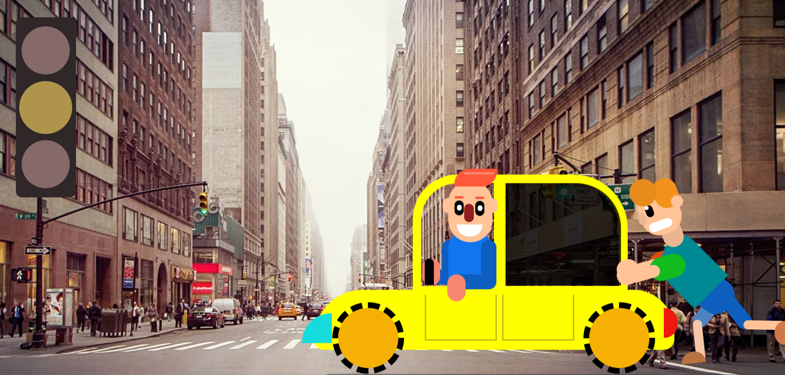

# 🚗 Animation on Pure CSS

  

🔗 Live Demo: [ [Your GitHub Pages Link]([https:/alexsand-r.github.io/lesson_13/](https://alexsand-r.github.io/lesson_13/))](https://alexsand-r.github.io/lesson_13/)

## This project uses CSS animations with keyframes and transitions to create smooth and dynamic animations of various elements. The car and characters are made with CSS.

This project uses **CSS animations** with **keyframes** and **transitions** to create smooth and dynamic animations for various elements.

### 🔑 Technologies Used

- **CSS Keyframes**: Keyframes are used to define the steps of an animation, specifying the start, intermediate, and end states of an element's properties. This allows for smooth transitions of properties like rotation or movement over time.

- **CSS Transitions**: Transitions are used to create smooth changes between states of an element, such as color, size, or position, typically triggered by user interactions (like hovering or clicking).

These animations help enhance user experience by providing smooth visual transitions and dynamic effects.

